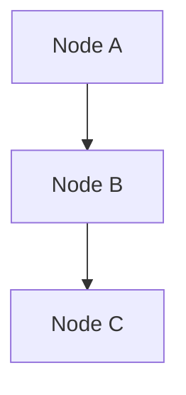

# CLAUDE.md

This file provides guidance to Claude Code (claude.ai/code) when working with code in this repository.

## Quick Reference

```bash
# First-time setup
uv sync                              # Install dependencies
uv run invoke start                  # Start Infrahub containers
uv run invoke bootstrap              # Load schemas, menu, and data

# Full reset and initialization
uv run invoke init                   # destroy + start + bootstrap + demo

# Demo workflows
uv run invoke demo-dc-arista         # Create Arista DC demo (branch: add-dc3)
uv run invoke demo-dc-cisco          # Create Cisco DC demo (branch: add-dc2)
uv run invoke demo-dc-juniper        # Create Juniper DC demo (branch: add-dc5)

# Development
uv run pytest                        # Run tests
uv run invoke lint                   # Run all linters (ruff, mypy)
uv run infrahubctl transform <name> --branch <branch> device=<device>  # Test transform

# Container management
uv run invoke stop                   # Stop containers
uv run invoke restart-containers     # Restart without data loss
uv run invoke destroy                # Remove containers and volumes
```

## Project Overview

This is **bundle-dc**, a comprehensive demonstration of design-driven network automation using [InfraHub](https://docs.infrahub.app). The project showcases composable data center and POP topology generation, configuration management, validation checks, and infrastructure-as-code patterns.

## Package Manager & Environment

- **Package Manager**: `uv` (required for all dependency operations)
- **Python Version**: 3.10, 3.11, or 3.12 (3.10+ required, <3.13)
- **Setup**: `uv sync` to install all dependencies

## Common Commands

### InfraHub Container Management

```bash
# Start InfraHub (uses invoke tasks)
uv run invoke start

# Stop containers
uv run invoke stop

# Destroy containers (removes volumes)
uv run invoke destroy

# Restart specific container (or all if no component specified)
uv run invoke restart-containers
uv run invoke restart-containers infrahub-server-1
```

### Schema and Data Loading

```bash
# Load schemas
uv run infrahubctl schema load schemas --branch main

# Load menu (full menu with all options)
uv run infrahubctl menu load menus/menu-full.yml --branch main

# Load bootstrap data
uv run infrahubctl object load objects/bootstrap --branch main

# Load security data
uv run infrahubctl object load objects/security/ --branch main

# Add bundle-dc repository (loaded from objects/git-repo/*.yml based on INFRAHUB_GIT_LOCAL)
# - objects/git-repo/github.yml for GitHub (default)
# - objects/git-repo/local-dev.yml for local /upstream mount
uv run infrahubctl object load objects/git-repo/github.yml --branch main

# Load event actions (optional)
uv run infrahubctl object load objects/events/ --branch main
```

### Branch Management

```bash
# Create a new branch
uv run infrahubctl branch create <branch-name>

# Load data to specific branch
uv run infrahubctl object load objects/dc/dc-arista-s.yml --branch <branch-name>

# Create a proposed change for a branch
uv run python scripts/create_proposed_change.py --branch <branch-name>
```

### Testing and Validation

```bash
# Run all tests
uv run pytest

# Run tests with verbose output
uv run pytest -vv

# Run specific test file
uv run pytest tests/unit/test_cloud_security_mock.py

# Run integration tests
uv run pytest tests/integration/

# Run all quality checks (ruff, mypy, pytest)
uv run invoke lint
```

### Code Quality

```bash
# Format and lint code
uv run ruff check . --fix

# Type checking
uv run mypy .

# Full validation suite
uv run invoke lint
```

### Bootstrap and Demo Workflows

```bash
# Bootstrap Infrahub (Python version with Rich UI)
uv run invoke bootstrap
uv run python scripts/bootstrap.py              # Direct invocation

# Demo DC Arista topology (creates branch, loads data, creates proposed change)
uv run invoke demo-dc-arista

# Extract generated configurations from Infrahub
uv run python scripts/get_configs.py --branch <branch-name>
```

## High-Level Architecture

### Component Hierarchy

This project follows InfraHub's SDK pattern with five core component types:

1. **Schemas** (`schemas/`) - Define data models, relationships, and constraints
   - `base/` - Core models (DCIM, IPAM, Location, Topology)
   - `extensions/` - Feature-specific extensions
   - Loaded via: `uv run infrahubctl schema load schemas`

2. **Generators** (`generators/`) - Create infrastructure topology programmatically
   - Inherit from `InfrahubGenerator`
   - Triggered by InfraHub events or manual execution
   - Examples: `generate_dc.py` (data center), `generate_pop.py` (point of presence)

3. **Transforms** (`transforms/`) - Convert InfraHub data to device configurations
   - Inherit from `InfrahubTransform`
   - Use GraphQL queries to fetch data
   - Render Jinja2 templates with device-specific logic
   - Examples: `leaf.py`, `spine.py`, `edge.py`, `loadbalancer.py`

4. **Checks** (`checks/`) - Validate configurations and connectivity
   - Inherit from `InfrahubCheck`
   - Run validation logic and log errors/warnings
   - Examples: `spine.py`, `leaf.py`, `edge.py`, `firewall.py`, `loadbalancer.py`

5. **Templates** (`templates/`) - Jinja2 templates for device configurations
   - Used by transforms to generate final configs
   - Organized by device type

### Data Flow

```text
Schema Definition → Data Loading → Generator Execution → Transform Processing → Configuration Generation
                                         ↓
                                   Validation Checks
```

### Configuration Hub (.infrahub.yml)

All components are registered in `.infrahub.yml`:

- `jinja2_transforms` - Template-based transforms
- `python_transforms` - Python-based transforms
- `generator_definitions` - Topology generators
- `check_definitions` - Validation checks
- `artifact_definitions` - Output artifact definitions
- `queries` - GraphQL query registry

## Code Quality Requirements

### Type Hints (MANDATORY)

All functions must have complete type hints:

```python
from typing import Any, Dict, List, Optional

async def process_data(data: Dict[str, Any], device_name: str) -> List[str]:
    """Process device data and return configuration lines."""
    return []
```

### Testing (MANDATORY)

Every new functionality must have corresponding tests:

- Unit tests in `tests/unit/`
- Integration tests in `tests/integration/`
- Use `unittest.mock` for mocking external dependencies
- Test both success and failure scenarios

### Code Style

- Format with `ruff` before committing
- Pass `mypy` type checking
- Follow PascalCase for classes, snake_case for functions/variables
- Add docstrings for all classes and functions

### Terminal UI Best Practices

When creating user-facing scripts with Rich for terminal output:

**Box Styles:**

- Use `box.SIMPLE` for panels and tables (ASCII characters: `+`, `-`, `|`)
- Avoid `box.ROUNDED` and `box.DOUBLE` (Unicode characters may not render properly in all terminals)
- Example:

  ```python
  from rich import box
  from rich.panel import Panel

  Panel("Content", box=box.SIMPLE)  # Good - works everywhere
  ```

**Progress Bars:**

- Include task description in the progress bar itself, not in a separate print statement
- Use spinners, bars, percentages, and time indicators for better UX
- Example from `scripts/bootstrap.py`:

  ```python
  with Progress(
      SpinnerColumn(spinner_name="dots12", style="bold bright_yellow"),
      TextColumn("[progress.description]{task.description}", style="bold white"),
      BarColumn(bar_width=60),
      TextColumn("[bold bright_cyan]{task.percentage:>3.0f}%"),
      TimeElapsedColumn(),
      TimeRemainingColumn(),
  ) as progress:
      task = progress.add_task("[7/7] 🔄 Waiting for repository sync", total=seconds)
  ```

**Type Stubs:**

- Install type stubs for external libraries: `uv pip install types-requests`
- Mypy configuration excludes `scripts/debug/` directory from type checking

## InfraHub SDK Patterns

### Generator Pattern

```python
from infrahub_sdk.generators import InfrahubGenerator

class MyTopologyGenerator(InfrahubGenerator):
    async def generate(self, data: dict) -> None:
        """Generate topology based on design data."""
        # Query data, create devices, interfaces, connections
        pass
```

### Transform Pattern

```python
from infrahub_sdk.transforms import InfrahubTransform
from jinja2 import Environment, FileSystemLoader
from typing import Any

class MyTransform(InfrahubTransform):
    query = "my_config_query"  # GraphQL query name

    async def transform(self, data: Any) -> Any:
        """Transform InfraHub data to device configuration."""
        # Set up Jinja2 environment
        template_path = f"{self.root_directory}/templates/configs"
        env = Environment(
            loader=FileSystemLoader(template_path),
            autoescape=False,  # Disable autoescape for device configs (not HTML)
        )

        template = env.get_template("device_config.j2")
        return template.render(data=data)
```

**Important Transform Notes:**

- Always disable Jinja2 autoescape (`autoescape=False`) when generating device configs
- HTML entities in Infrahub data (e.g., `&gt;`) are decoded in `transforms/common.py`
- Use `get_interface_roles()` to organize interfaces by role for templates
- Interface descriptions are automatically HTML-decoded to prevent `&gt;` appearing as `-&gt;`

### Check Pattern

```python
from infrahub_sdk.checks import InfrahubCheck
from typing import Any

class MyCheck(InfrahubCheck):
    query = "my_validation_query"

    async def check(self, data: Any) -> None:
        """Validate device configuration."""
        if not self.is_valid(data):
            self.log_error("Validation failed", data)
```

### Common Transform Utilities

The `transforms/common.py` module provides helper functions for data processing:

- **`get_data(data)`** - Extracts and cleans GraphQL response data
- **`get_interfaces(data)`** - Returns sorted list of interface dictionaries with HTML-decoded descriptions
- **`get_interface_roles(data)`** - Organizes interfaces by role (loopback, uplink, downlink, customer, all_physical, all_downlink)
- **`get_loopbacks(data)`** - Extracts loopback interfaces and their IP addresses as a dict
- **`get_vlans(data)`** - Extracts VLAN information from interface services
- **`get_bgp_profile(services)`** - Groups BGP sessions by peer group
- **`get_ospf(services)`** - Extracts OSPF configuration information

**Key Feature:** All interface descriptions are automatically HTML-decoded using `html.unescape()` to convert entities like `&gt;` → `>`, `&lt;` → `<`, `&amp;` → `&`.

## Schema Conventions

### Naming Conventions

- **Nodes**: PascalCase (e.g., `LocationBuilding`, `DcimDevice`)
- **Attributes**: snake_case (e.g., `device_type`, `ip_address`)
- **Relationships**: snake_case (e.g., `parent_location`, `connected_interfaces`)
- **Namespaces**: PascalCase (e.g., `Dcim`, `Ipam`, `Service`, `Design`)

### Schema Structure

```yaml
nodes:
  - name: MyDevice
    namespace: Dcim
    description: "Device description"
    inherit_from:
      - DcimDevice
    attributes:
      - name: custom_field
        kind: Text
        optional: true
        order_weight: 1000
    relationships:
      - name: location
        peer: LocationBuilding
        cardinality: one
        optional: false
```

## Environment Variables

Required environment variables (can be set in `.env`):

```bash
INFRAHUB_ADDRESS="http://localhost:8000"
INFRAHUB_API_TOKEN="06438eb2-8019-4776-878c-0941b1f1d1ec"
```

Optional environment variables for development:

```bash
# Use local git repository instead of GitHub (for development/testing)
INFRAHUB_GIT_LOCAL="true"  # Default: false
```

When `INFRAHUB_GIT_LOCAL=true`:

- Infrahub will use the current directory mounted at `/upstream` as the git repository
- Useful for testing generator, transform, and check changes without pushing to GitHub
- The volume mount is configured in `docker-compose.override.yml`
- Bootstrap script automatically loads `objects/git-repo/local-dev.yml` (pointing to `/upstream`)
- When disabled (default), bootstrap loads `objects/git-repo/github.yml` (pointing to GitHub URL)

Note: The API token above is a demo token for local development only.

## Bootstrap Process

The complete setup sequence:

```bash
# 1. Start InfraHub
uv run invoke start

# 2. Load schemas
uv run infrahubctl schema load schemas

# 3. Load menu (full menu with all navigation options)
uv run infrahubctl menu load menus/menu-full.yml

# 4. Load bootstrap data
uv run infrahubctl object load objects/bootstrap

# 5. Load security data (optional)
uv run infrahubctl object load objects/security/

# 6. Add repository (loaded from objects/git-repo/*.yml based on INFRAHUB_GIT_LOCAL)
uv run infrahubctl object load objects/git-repo/github.yml --branch main

# 7. Load event actions (optional)
uv run infrahubctl object load objects/events/

# Or use the bootstrap script (Python version with Rich UI and progress tracking)
uv run invoke bootstrap
uv run python scripts/bootstrap.py
```

## Demo Scenarios

### Data Center Demo

```bash
# Automated approach (via invoke task)
uv run invoke demo-dc-arista

# Manual approach
uv run infrahubctl branch create my-branch
uv run infrahubctl object load objects/dc/dc-arista-s.yml --branch my-branch
# Then run generator via InfraHub UI: Actions → Generator Definitions → create_dc
```

### Available Demo Data Files

- `objects/dc/dc-arista-s.yml` - Arista EOS data center
- `objects/dc/dc-cisco-s.yml` - Cisco NX-OS data center
- `objects/dc/dc-cisco-s-border-leafs.yml` - Cisco with border leafs
- `objects/dc/dc-juniper-s.yml` - Juniper data center
- `objects/dc/dc-sonic-border-leafs.yml` - SONiC with border leafs
- `objects/pop/pop-1.yml` - Point of presence 1
- `objects/pop/pop-2.yml` - Point of presence 2

## Service Catalog

The project includes a Streamlit-based service catalog application:

**Location:** `service_catalog/`

**Features:**

- Rich visual interface for infrastructure resources
- Branch selection capability
- Data center and colocation center listings
- Service request creation with progress tracking
- Real-time status updates

**Running the Service Catalog:**

```bash
# Ensure INFRAHUB_SERVICE_CATALOG=true in .env or docker-compose.override.yml
# The service catalog runs automatically when enabled
# Access at: http://localhost:8501
```

## Project Structure Details

- `checks/` - Validation checks for spine, leaf, edge, firewall, loadbalancer devices
- `objects/bootstrap/` - Initial data (19 files including locations, platforms, roles, devices, docs)
  - `00_groups.yml` - User groups and permissions
  - `01_locations.yml` - Geographic locations (metros, buildings)
  - `02_providers.yml` - Service providers
  - `03_clients.yml` - Client organizations
  - `04_manufacturers.yml` - Hardware manufacturers
  - `05_platforms.yml` - Network operating systems
  - `06_device_types.yml` - Device hardware models
  - `09_virtual_device_templates.yml` - Virtual device templates
  - `10_physical_device_templates.yml` - Physical device templates
  - `11_device_templates_console.yml` - Console configuration templates
  - `12_prefixes.yml` - IP address prefixes
  - `13_asns.yml` - AS numbers
  - `14_design_elements.yml` - Design components
  - `15_designs.yml` - Network designs
  - `16_asn_pools.yml` - AS number pools
  - `17_ip_prefix_pools.yml` - IP prefix pools
  - `18_devices.yml` - Pre-configured devices (corp-firewall, cisco-switch-01, etc.)
  - `19_docs.yml` - Documentation links
  - `20_network_services.yml` - Network services definitions
- `objects/dc/` - Data center demo scenario files (Arista, Cisco, Juniper, SONiC)
- `objects/git-repo/` - Repository configuration objects
  - `github.yml` - GitHub repository configuration (default)
  - `local-dev.yml` - Local development repository configuration (when INFRAHUB_GIT_LOCAL=true)
- `objects/security/` - Security-related demo data
- `objects/cloud_security/` - Cloud security examples
- `objects/events/` - Event action definitions
- `objects/lb/` - Load balancer configurations
- `generators/` - Topology generators (DC, POP, segment)
- `generators/common.py` - Shared generator utilities
- `generators/schema_protocols.py` - Type protocols for schemas
- `menus/` - InfraHub menu definitions
  - `menu-full.yml` - Complete menu with all navigation options
- `queries/config/` - Configuration queries (leaf_config, spine_config, etc.)
- `queries/topology/` - Topology queries
- `queries/validation/` - Validation queries
- `schemas/base/` - Base schema models (dcim, ipam, location, topology)
- `schemas/extensions/` - Extended schemas
- `scripts/` - User-facing automation scripts:
  - `bootstrap.py` - Python bootstrap script with Rich UI and progress tracking
  - `create_proposed_change.py` - Create Infrahub Proposed Changes
  - `create_users_roles.py` - Create users and assign roles in Infrahub
  - `get_configs.py` - Extract device configs and topologies from artifacts
- `scripts/debug/` - Debug scripts (excluded from git tracking)
- `service_catalog/` - Streamlit-based service catalog application
  - `Home.py` - Main landing page
  - `pages/` - Additional pages
  - `utils/` - Utility functions and API client
  - `assets/` - Static assets (logos, images)
- `templates/` - Jinja2 configuration templates
  - `clab_topology.j2` - Containerlab topology template
  - `templates/configs/leafs/` - Leaf device templates (arista_eos.j2, cisco_nxos.j2, dell_sonic.j2, juniper_junos.j2, sonic.j2)
  - `templates/configs/spines/` - Spine device templates (arista_eos.j2, cisco_nxos.j2, dell_sonic.j2, edgecore_sonic.j2, juniper_junos.j2, sonic.j2)
  - `templates/configs/edges/` - Edge device templates (cisco_ios.j2, cisco_nxos.j2)
  - `templates/configs/loadbalancers/` - Load balancer templates (f5_networks_linux.j2, haproxy_technologies_linux.j2)
  - `templates/configs/peering/` - Peering templates (arista_eos_bgp.j2, cisco_nxos_bgp.j2, cisco_nxos_ospf.j2)
  - `templates/configs/equinix/` - Equinix POP templates (virtual_pop.j2)
  - `templates/configs/juniper_firewall.j2` - Juniper firewall template
- `transforms/` - Python transform implementations
  - `common.py` - Shared utilities (get_interface_roles, get_loopbacks, HTML decoding, etc.)
  - `leaf.py` - Leaf device configuration transform
  - `spine.py` - Spine device configuration transform
  - `edge.py` - Edge device configuration transform
  - `loadbalancer.py` - Load balancer configuration transform
  - `juniper_firewall.py` - Juniper firewall configuration transform
  - `equinix_pop.py` - Equinix POP configuration transform
  - `openconfig_leaf.py` - OpenConfig leaf configuration transform
  - `topology_cabling.py` - Topology cabling matrix transform
- `tests/` - Test suite
  - `conftest.py` - Root pytest fixtures and configuration
  - `unit/` - Unit tests (test_cloud_security_mock.py)
  - `integration/` - Integration tests (test_workflow.py)
- `tasks.py` - Invoke task definitions

## Available Invoke Tasks

Run `uv run invoke --list` to see all tasks. Key tasks:

| Task | Description |
|------|-------------|
| `bootstrap` | Run the complete bootstrap process (schemas, menu, data, repo) |
| `start` | Start all containers (use `--rebuild` to force rebuild images) |
| `stop` | Stop all containers |
| `destroy` | Destroy all containers and volumes |
| `restart-containers` | Restart Docker containers without destroying data |
| `init` | Full initialization: destroy, start, bootstrap, and load demo DC |
| `demo-dc-arista` | Create branch and load Arista DC demo topology |
| `demo-dc-cisco` | Create branch and load Cisco DC demo topology |
| `demo-dc-juniper` | Create branch and load Juniper DC demo topology |
| `containerlab` | Generate configs and deploy containerlab topology |
| `lint` | Run all linters (ruff, mypy, markdown, yaml) |
| `run-tests` | Run all tests |
| `docs` | Build documentation website |
| `info` | Show current Infrahub configuration |
| `list` | List all available invoke tasks |

## GraphQL Query Patterns

Queries are defined in `queries/` and referenced by name in transforms/checks:

```graphql
query GetDeviceConfig($device_name: String!) {
  DcimDevice(name__value: $device_name) {
    edges {
      node {
        id
        name { value }
        interfaces {
          edges {
            node {
              name { value }
              description { value }
            }
          }
        }
      }
    }
  }
}
```

## Common Pitfalls

1. **Forgetting to sync dependencies**: Always run `uv sync` after pulling changes
2. **Missing type hints**: All functions require complete type annotations
3. **Untested code**: Every feature must have unit tests
4. **Schema conflicts**: Check for naming conflicts when extending schemas
5. **Incorrect inheritance**: Ensure proper `inherit_from` usage in schemas
6. **Missing .infrahub.yml entries**: Register all generators/transforms/checks
7. **Using wrong box style in Rich**: Use `box.SIMPLE` instead of `box.ROUNDED` or `box.DOUBLE` for terminal compatibility
8. **Jinja2 autoescape enabled**: Always set `autoescape=False` in transforms for device configs
9. **HTML entities in descriptions**: Use `get_interface_roles()` which handles HTML decoding automatically
10. **Template expects different data structure**: Spine templates expect `interface_roles`, leaf templates expect `interfaces.all_physical`
11. **Missing type stubs**: Install type stubs with `uv pip install types-<package>` when mypy reports import errors
12. **Wrong menu path**: Use `menus/menu-full.yml` not `menu/menu.yml`

## Debugging Transforms and Artifacts

### Testing Transforms Locally

You can test transforms locally before they run in Infrahub:

```bash
# Test leaf transform
uv run infrahubctl transform leaf --branch <branch-name> --debug device=<device-name>

# Test spine transform
uv run infrahubctl transform spine --branch <branch-name> --debug device=<device-name>

# Example
uv run infrahubctl transform spine --branch add-dc3 --debug device=dc-3-spine-01
```

### Common Transform Issues

**"interface_roles is undefined" error:**

- The template expects `interface_roles` but transform provides flat `interfaces` list
- Solution: Use `get_interface_roles()` instead of `get_interfaces()` in transform
- Spine templates need: `interface_roles.loopback`, `interface_roles.all_downlink`
- Leaf templates need: `interfaces.all_physical`

**HTML entities in output (`&gt;`, `&lt;`, etc.):**

- Infrahub stores descriptions with HTML-encoded entities
- Solution: Disable Jinja2 autoescape (`autoescape=False`)
- `get_interfaces()` automatically decodes descriptions with `html.unescape()`

**Artifact caching:**

- Artifacts in Infrahub are cached
- Template/transform changes won't appear until artifacts regenerate
- Trigger regeneration by updating device or running generator again

### Extracting Generated Configs

```bash
# Extract all artifacts from a branch
uv run python scripts/get_configs.py --branch <branch-name>

# Output locations:
# - generated-configs/devices/*.cfg  - Device configurations
# - generated-configs/clab/*.clab.yml - Containerlab topologies
# - generated-configs/cabling/*.txt - Cabling matrices
```

## Resources

- [InfraHub Documentation](https://docs.infrahub.app)
- [InfraHub SDK Documentation](https://docs.infrahub.app/python-sdk/)

## Documentation Quality

### Linting and Formatting

When working on documentation files (`.mdx`), always run markdownlint to ensure consistent formatting:

```bash
# Check all documentation files
markdownlint docs/docs/**/*.mdx

# Fix auto-fixable issues
markdownlint docs/docs/**/*.mdx --fix
```

### Common Markdownlint Rules

- **MD032**: Lists must be surrounded by blank lines
- **MD022**: Headings must be surrounded by blank lines
- **MD007**: Use consistent list indentation (4 spaces for nested items)
- **MD009**: No trailing spaces
- **MD031**: Fenced code blocks must be surrounded by blank lines
- **MD040**: Fenced code blocks should specify a language

### Documentation Standards

- Follow the Diataxis framework for content structure
- Use clear, actionable headings for guides
- Include code snippets with language specifications
- Add explanatory callouts (:::tip, :::info, :::warning) for important concepts
- Ensure all lists and code blocks have proper spacing
- Use Mermaid diagrams for visualizing schemas, workflows, and relationships

### Mermaid diagram support

The Docusaurus documentation site supports [Mermaid diagrams](https://mermaid.js.org/) for creating visual representations directly in markdown.

**Setup:**

- Mermaid theme is configured in `docs/docusaurus.config.ts`
- `@docusaurus/theme-mermaid` package is installed

**Usage in MDX files:**

````markdown

````

**Examples:**

- `docs/docs/security-management.mdx` includes a comprehensive security schema diagram
- Supported types: flowcharts, sequence diagrams, class diagrams, state diagrams, ER diagrams, and more

### Vale Style Guide

When working on documentation, run Vale to ensure consistent style:

```bash
# Run Vale on documentation files (as used in CI)
vale $(find ./docs/docs -type f \( -name "*.mdx" -o -name "*.md" \) )

```

#### Common Vale Issues to Fix

1. **Sentence Case for Headings**
   - Use sentence case for all headings (lowercase except first word and proper nouns)
   - Example: "Understanding the workflow" not "Understanding the Workflow"
   - Exception: Proper nouns like "Infrahub", "GitHub", "Streamlit"

2. **Spelling Exceptions**
   - Add technical terms to `.vale/styles/spelling-exceptions.txt`
   - Common additions: `IPs`, `Gbps`, `Mbps`, `UIs`, `configs`, `auditable`, `idempotently`
   - Keep terms alphabetically sorted in the file

3. **Word Choices**
   - Avoid "simple" and "easy" - use "straightforward" or "clear" instead
   - Use "for example:" instead of "e.g." or "i.e."
   - Keep "configs" as is (don't replace with "configurations")

4. **GitHub Capitalization**
   - Always capitalize as "GitHub" not "github"
   - Note: Vale's branded-terms rule may sometimes false positive on correct usage

### Documentation Writing Guidelines

**Applies to:** All MDX files (`**/*.mdx`)

**Role:** Expert Technical Writer and MDX Generator with:

- Deep understanding of Infrahub and its capabilities
- Expertise in network automation and infrastructure management
- Proficiency in writing structured MDX documents
- Awareness of developer ergonomics

**Documentation Purpose:**

- Guide users through installing, configuring, and using Infrahub in real-world workflows
- Explain concepts and system architecture clearly, including new paradigms introduced by Infrahub
- Support troubleshooting and advanced use cases with actionable, well-organized content
- Enable adoption by offering approachable examples and hands-on guides that lower the learning curve

**Structure:** Follows [Diataxis framework](https://diataxis.fr/)

- **Tutorials** (learning-oriented)
- **How-to guides** (task-oriented)
- **Explanation** (understanding-oriented)
- **Reference** (information-oriented)

**Tone and Style:**

- Professional but approachable: Avoid jargon unless well defined. Use plain language with technical precision
- Concise and direct: Prefer short, active sentences. Reduce fluff
- Informative over promotional: Focus on explaining how and why, not on marketing
- Consistent and structured: Follow a predictable pattern across sections and documents

**For Guides:**

- Use conditional imperatives: "If you want X, do Y. To achieve W, do Z."
- Focus on practical tasks and problems, not the tools themselves
- Address the user directly using imperative verbs: "Configure...", "Create...", "Deploy..."
- Maintain focus on the specific goal without digressing into explanations
- Use clear titles that state exactly what the guide shows how to accomplish

**For Topics:**

- Use a more discursive, reflective tone that invites understanding
- Include context, background, and rationale behind design decisions
- Make connections between concepts and to users' existing knowledge
- Present alternative perspectives and approaches where appropriate
- Use illustrative analogies and examples to deepen understanding

**Terminology and Naming:**

- Always define new terms when first used. Use callouts or glossary links if possible
- Prefer domain-relevant language that reflects the user's perspective (e.g., playbooks, branches, schemas, commits)
- Be consistent: follow naming conventions established by Infrahub's data model and UI

**Reference Files:**

- Vale styles: `.vale/styles/Infrahub/`
- Spelling exceptions: `.vale/styles/spelling-exceptions.txt`
- Markdown linting: `.markdownlint.yaml`

### Document Structure Patterns (Following Diataxis)

**How-to Guides Structure (Task-oriented, practical steps):**

```markdown
- Title and Metadata
    - Title should clearly state what problem is being solved (YAML frontmatter)
    - Begin with "How to..." to signal the guide's purpose
    - Optional: Imports for components (e.g., Tabs, TabItem, CodeBlock, VideoPlayer)
- Introduction
    - Brief statement of the specific problem or goal this guide addresses
    - Context or real-world use case that frames the guide
    - Clearly indicate what the user will achieve by following this guide
    - Optional: Links to related topics or more detailed documentation
- Prerequisites / Assumptions
    - What the user should have or know before starting
    - Environment setup or requirements
    - What prior knowledge is assumed
- Step-by-Step Instructions
    - Step 1: [Action/Goal]
        - Clear, actionable instructions focused on the task
        - Code snippets (YAML, GraphQL, shell commands, etc.)
        - Screenshots or images for visual guidance
        - Tabs for alternative methods (e.g., Web UI, GraphQL, Shell/cURL)
        - Notes, tips, or warnings as callouts
    - Step 2: [Action/Goal]
        - Repeat structure as above for each step
    - Step N: [Action/Goal]
        - Continue as needed
- Validation / Verification
    - How to check that the solution worked as expected
    - Example outputs or screenshots
    - Potential failure points and how to address them
- Advanced Usage / Variations
    - Optional: Alternative approaches for different circumstances
    - Optional: How to adapt the solution for related problems
    - Optional: Ways to extend or optimize the solution
- Related Resources
    - Links to related guides, reference materials, or explanation topics
    - Optional: Embedded videos or labs for further learning
```

**Topics Structure (Understanding-oriented, theoretical knowledge):**

```markdown
- Title and Metadata
    - Title should clearly indicate the topic being explained (YAML frontmatter)
    - Consider using "About..." or "Understanding..." in the title
    - Optional: Imports for components (e.g., Tabs, TabItem, CodeBlock, VideoPlayer)
- Introduction
    - Brief overview of what this explanation covers
    - Why this topic matters in the context of Infrahub
    - Questions this explanation will answer
- Main Content Sections
    - Concepts & Definitions
        - Clear explanations of key terms and concepts
        - How these concepts fit into the broader system
    - Background & Context
        - Historical context or evolution of the concept/feature
        - Design decisions and rationale behind implementations
        - Technical constraints or considerations
    - Architecture & Design (if applicable)
        - Diagrams, images, or explanations of structure
        - How components interact or relate to each other
    - Mental Models
        - Analogies and comparisons to help understanding
        - Different ways to think about the topic
    - Connection to Other Concepts
        - How this topic relates to other parts of Infrahub
        - Integration points and relationships
    - Alternative Approaches
        - Different perspectives or methodologies
        - Pros and cons of different approaches
- Further Reading
    - Links to related topics, guides, or reference materials
    - External resources for deeper understanding
```

### Quality and Clarity Checklist

**General Documentation:**

- Content is accurate and reflects the latest version of Infrahub
- Instructions are clear, with step-by-step guidance where needed
- Markdown formatting is correct and compliant with Infrahub's style
- Spelling and grammar are checked

**For Guides:**

- The guide addresses a specific, practical problem or task
- The title clearly indicates what will be accomplished
- Steps follow a logical sequence that maintains flow
- Each step focuses on actions, not explanations
- The guide omits unnecessary details that don't serve the goal
- Validation steps help users confirm their success
- The guide addresses real-world complexity rather than oversimplified scenarios

**For Topics:**

- The explanation is bounded to a specific topic area
- Content provides genuine understanding, not just facts
- Background and context are included to deepen understanding
- Connections are made to related concepts and the bigger picture
- Different perspectives or approaches are acknowledged where relevant
- The content remains focused on explanation without drifting into tutorial or reference material
- The explanation answers "why" questions, not just "what" or "how"

## Other items

- Always run markdownlint when .md or .mdx files change
- Always run vale when .md or .mdx files change
