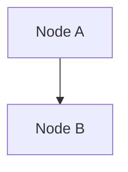

# AGENTS.md - Documentation Site

> Guidance for AI coding assistants working in the `docs/` directory.
> Parent: [../AGENTS.md](../AGENTS.md)

## Overview

This is a [Docusaurus](https://docusaurus.io/) documentation site for the bundle-dc project. It uses a different tech stack than the main Python project.

## Tech Stack

- **Framework**: Docusaurus 3.x
- **Language**: TypeScript
- **Package Manager**: npm (not uv)
- **Content Format**: MDX (Markdown + JSX)

## Build Commands

```bash
# Install dependencies
npm install

# Start development server
npm start

# Build for production
npm run build

# Type check
npm run typecheck
```

## Code Style Guidelines

### MDX Content

- Follow the [Diataxis framework](https://diataxis.fr/) for content structure:
  - **Tutorials** (learning-oriented)
  - **How-to guides** (task-oriented)
  - **Explanation** (understanding-oriented)
  - **Reference** (information-oriented)

- Use sentence case for headings (lowercase except first word and proper nouns)
- Specify language in fenced code blocks
- Surround lists and code blocks with blank lines

### Mermaid Diagrams

Mermaid is supported for flowcharts, sequence diagrams, etc:

````markdown

````

## Linting Requirements

**Always run these before committing documentation changes:**

```bash
# Markdown linting
markdownlint docs/docs/**/*.mdx

# Auto-fix markdown issues
markdownlint docs/docs/**/*.mdx --fix

# Style guide checking
vale $(find ./docs/docs -type f \( -name "*.mdx" -o -name "*.md" \))
```

### Common Markdownlint Rules

- **MD032**: Lists must be surrounded by blank lines
- **MD022**: Headings must be surrounded by blank lines
- **MD007**: Use 4 spaces for nested list items
- **MD031**: Fenced code blocks must be surrounded by blank lines
- **MD040**: Fenced code blocks should specify a language

### Common Vale Issues

1. **Sentence case headings** - Use "Understanding the workflow" not "Understanding the Workflow"
2. **Avoid "simple/easy"** - Use "straightforward" or "clear" instead
3. **Spelling exceptions** - Add terms to `.vale/styles/spelling-exceptions.txt`
4. **Proper nouns** - Always capitalize: Infrahub, GitHub, Streamlit

## Directory Structure

```
docs/
├── docs/           # MDX content files
├── src/            # React components and pages
├── static/         # Static assets (images, etc.)
├── docusaurus.config.ts  # Site configuration
├── sidebars.ts     # Navigation structure
└── package.json    # Dependencies
```

## Key Files

- `docusaurus.config.ts` - Main configuration, Mermaid theme settings
- `sidebars.ts` - Define navigation hierarchy
- `docs/docs/*.mdx` - Documentation content

## Documentation Writing Guidelines

### For How-to Guides

- Title: "How to [accomplish task]"
- Use conditional imperatives: "If you want X, do Y"
- Focus on actions, not explanations
- Include validation steps

### For Topics/Explanations

- Title: "About [topic]" or "Understanding [concept]"
- Include context and rationale
- Make connections to related concepts
- Answer "why" questions

## Common Pitfalls

1. **Wrong package manager** - Use `npm`, not `uv` or `yarn`
2. **Missing blank lines** - Always surround lists/code blocks with blank lines
3. **Title case headings** - Use sentence case instead
4. **Missing code language** - Always specify language in code fences
5. **Skipping linters** - Always run markdownlint and vale before committing
